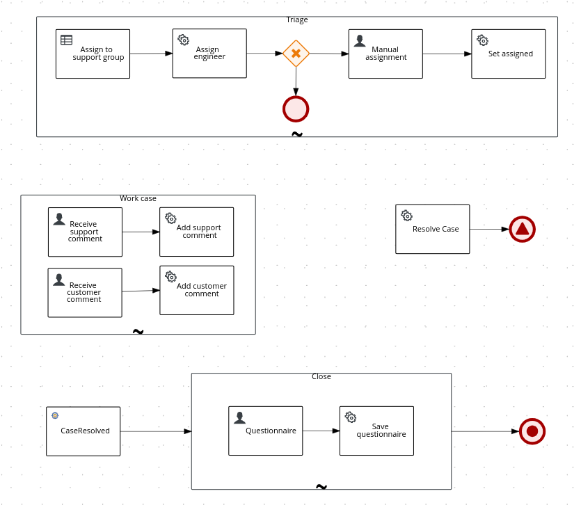

# Presolved Case Management Sample App Using Kogito

## Overview

Sample application to create case and subtask on demand basis and users can resolve the case and feedback child case will be created to get the customer feedback after completion


### workflow/ process



### Decision Table to assign task to user(similar to pega get next work)


Workflow to raise service ticket and the ticket will be assigned to user based on skill set which is configured in decicion table.

Once assigned the support case status will be set to `WAITING_FOR_OWNER` state meaning
that the engineer has to work on the case and provide a solution or add a
comment asking for more information.

At any moment customers or engineers can add comments until the case is
`CLOSED`.

The case can be set as `RESOLVED` by either an engineer or a customer who raised the ticket. Once
this happens a Questionnaire task will be made available where the customer
can provide feedback about the case resolution.

After the Questionnaire submission the case will be `CLOSED` and the process
will terminate.

## Build and run

### Prerequisites

You will need:

* Java 11+ installed
* Environment variable JAVA_HOME set accordingly
* Maven 3.8.1+ installed

When using native image compilation, you will also need:

* GraalVM 19.3+ installed
* Environment variable GRAALVM_HOME set accordingly
* GraalVM native image needs as well the [native-image extension](https://www.graalvm.org/reference-manual/native-image/)
* Note that GraalVM native image compilation typically requires other packages (glibc-devel, zlib-devel and gcc) to be installed too, please refer to GraalVM installation documentation for more details.

### Compile and Run in Local Dev Mode

```sh
mvn clean compile quarkus:dev
```


### Package and Run in JVM mode

```sh
mvn clean package
java -jar target/quarkus-app/quarkus-run.jar
```

or on windows

```sh
mvn clean package
java -jar target\quarkus-app\quarkus-run.jar
```

### Package and Run using Local Native Image

Note that this requires GRAALVM_HOME to point to a valid GraalVM installation

```sh
mvn clean package -Pnative
```

To run the generated native executable, generated in `target/`, execute

```{bash}
./target/flexible-process-quarkus-runner
```

## Usage example


### Create a support case

Given the following support case:

```{json}
{
  "supportCase": {
    "customer": "Paco the customer",
    "description": "Kogito is not working for some reason.",
    "product": {
      "family": "Middleware",
      "name": "Kogito"
    }
  }
}
```

Create a POST request to the service desk endpoint.

```{bash}
curl -D -H 'Content-Type:application/json' -H 'Accept:application/json' -d @docs/requests/newTicket.json http://localhost:8080/serviceCase
```

Expect a response containing the ticket id and the current status of the process data where the engineer is assigned and the state is `WAITING_FOR_OWNER`. Note that also a Location HTTP Header
is present:

```{bash}
HTTP/1.1 201 Created
Content-Length: 303
Content-Type: application/json
Location: http://localhost:8080/serviceCase/de42a39a-2711-4d23-a890-aad24fb8e924

{
  "id": "de42a39a-2711-4d23-a890-aad24fb8e924",
  "supportCase": {
    "product": {
      "name": "Kogito",
      "family": "Middleware"
    },
    "description": "Kogito is not working for some reason.",
    "engineer": "kelly",
    "customer": "Paco the customer",
    "state": "WAITING_FOR_OWNER",
    "comments": null,
    "questionnaire": null
  },
  "supportGroup": "Kogito"
}
```

### Add a support comment

As this is a flexible process, it is up to the customer or the engineer to decide when the case is `RESOLVED`. Both ends can add comments
and each time a comment is added the state will be updated as waiting for the other party.

There are no pre-existing tasks for adding comments but an endpoint is available to instantiate these ad-hoc tasks.

For that an empty post should be sent to `/serviceCase/ReceiveSupportComment`. Note the extra flag to retreive the response headers.

```{bash}
$ curl -D - -XPOST -H 'Content-Type:application/json' -H 'Accept:application/json' http://localhost:8080/serviceCase/b3c75b24-2691-4a76-902c-c9bc29ea076c/ReceiveSupportComment

HTTP/1.1 201 Created
Content-Length: 303
Content-Type: application/json
Location: http://localhost:8080/serviceCase/de42a39a-2711-4d23-a890-aad24fb8e924/ReceiveSupportComment/36e69fa2-2e5a-4ac5-9115-b326499ff877

{"id":"de42a39a-2711-4d23-a890-aad24fb8e924","supportCase":{"product":{"name":"Kogito","family":"Middleware"},"description":"Kogito is not working for some reason.","engineer":"kelly","customer":"Paco the customer","state":"WAITING_FOR_OWNER","comments":null,"questionnaire":null},"supportGroup":"Kogito"}
```

The response returns an HTTP Location header with the endpoint of the generated task.

Use this path to create the comment. It is important to have in mind the user and group query parameters that provide information about the user performing the task and the group he/she belongs to because
this task is restricted to the _support_ group

```{bash}
curl -H 'Content-Type:application/json' -H 'Accept:application/json' -d @docs/requests/supportComment.json http://localhost:8080/serviceCase/de42a39a-2711-4d23-a890-aad24fb8e924/ReceiveSupportComment/36e69fa2-2e5a-4ac5-9115-b326499ff877?user=kelly&group=support
```

And the data containing the comment and the updated state will be returned:

```{json}
{
  "id": "de42a39a-2711-4d23-a890-aad24fb8e924",
  "supportCase": {
    "product": {
      "name": "Kogito",
      "family": "Middleware"
    },
    "description": "Kogito is not working for some reason.",
    "engineer": "kelly",
    "customer": "Paco the customer",
    "state": "WAITING_FOR_CUSTOMER",
    "comments": [
      {
        "author": "kelly",
        "date": 1594034179.628926,
        "text": "Have you tried to switch it off and on again?"
      }
    ],
    "questionnaire": null
  },
  "supportGroup": "Kogito"
}
```

### Add a customer comment

Now it's time for the customer to reply to the engineer's comment. For that an empty post should be sent to
`/serviceCase/ReceiveCustomerComment`. Note the extra flag to retreive the response headers.

```{bash}
$ curl -D - -XPOST -H 'Content-Type:application/json' -H 'Accept:application/json' http://localhost:8080/serviceCase/b3c75b24-2691-4a76-902c-c9bc29ea076c/ReceiveCustomerComment

HTTP/1.1 201 Created
Content-Length: 305
Content-Type: application/json
Location: http://localhost:8080/serviceCase/b3c75b24-2691-4a76-902c-c9bc29ea076c/ReceiveSupportComment/1ac85d3c-c02c-11ea-b3de-0242ac130004

{"id":"b3c75b24-2691-4a76-902c-c9bc29ea076c","supportCase":{"product":{"name":"Kogito","family":"Middleware"},"description":"Kogito is not working for some reason.","engineer":"kelly","customer":"Paco the customer","state":"WAITING_FOR_CUSTOMER","comments":null,"questionnaire":null},"supportGroup":"Kogito"}
```

Similar to the previous operation, the Location HTTP header contains the reference to the task.

Use this path to create the comment. It is important to have in mind the user and group query parameters that provide information about the user performing the task and the group he/she belongs to because
this task is restricted to the _customer_ group

```{bash}
curl -H 'Content-Type:application/json' -H 'Accept:application/json' -d @docs/requests/customerComment.json http://localhost:8080/serviceCase/b3c75b24-2691-4a76-902c-c9bc29ea076c/ReceiveCustomerComment/1ac85d3c-c02c-11ea-b3de-0242ac130004?user=Paco&group=customer
```

And the data containing the comment and the updated state will be returned:

```{json}
{
  "id": "b3c75b24-2691-4a76-902c-c9bc29ea076c",
  "supportCase": {
    "product": {
      "name": "Kogito",
      "family": "Middleware"
    },
    "description": "Kogito is not working for some reason.",
    "engineer": "kelly",
    "customer": "Paco the customer",
    "state": "WAITING_FOR_OWNER",
    "comments": [
      {
        "author": "kelly",
        "date": 1594034179.628926,
        "text": "Have you tried to switch it off and on again?"
      },
      {
        "author": "Paco",
        "date": 1594034179.628926,
        "text": "Great idea!"
      }
    ],
    "questionnaire": null
  },
  "supportGroup": "Kogito"
}
```

### Resolving the case

In this case, the customer is happy with the provided resolution and will proceed to set the case as `RESOLVED`.

```{bash}
curl -XPOST -H 'Content-Type:application/json' -H 'Accept:application/json' http://localhost:8080/serviceCase/b3c75b24-2691-4a76-902c-c9bc29ea076c/Resolve_Case
```

Check the response where the state is now set as `RESOLVED`.

```{json}
{
  "id": "b3c75b24-2691-4a76-902c-c9bc29ea076c",
  "supportCase": {
    "product": {
      "name": "Kogito",
      "family": "Middleware"
    },
    "description": "Kogito is not working for some reason.",
    "engineer": "kelly",
    "customer": "Paco the customer",
    "state": "RESOLVED",
    "comments": [
      {
        "author": "kelly",
        "date": 1594034179.628926,
        "text": "Support: Have you tried to switch it off and on again?"
      },
      {
        "author": "Paco",
        "date": 1594034179.628926,
        "text": "Great idea!"
      }
    ],
    "questionnaire": null
  },
  "supportGroup": "Kogito"
}
```

### Feedback 

There is a milestone waiting for a CaseResolved event. When received a Questionnaire task is
created and assigned to the `customer` group.

In order to know the task instance id, the `tasks` endpoint must be queried.

```{bash}
$ curl -H 'Content-Type:application/json' -H 'Accept:application/json' http://localhost:8080/serviceCase/b3c75b24-2691-4a76-902c-c9bc29ea076c/tasks
[
  {"id:"2cd185b6-d6db-4984-a0ae-9dc4fa15cb6d", "name": "Questionnaire"}
]
```

Use this id in the path:

```{bash}
curl -XPOST -H 'Content-Type:application/json' -H 'Accept:application/json' -d @docs/requests/questionnaire.json http://localhost:8080/serviceCase/b3c75b24-2691-4a76-902c-c9bc29ea076c/Questionnaire/2cd185b6-d6db-4984-a0ae-9dc4fa15cb6d?user=Paco&group=customer
```
